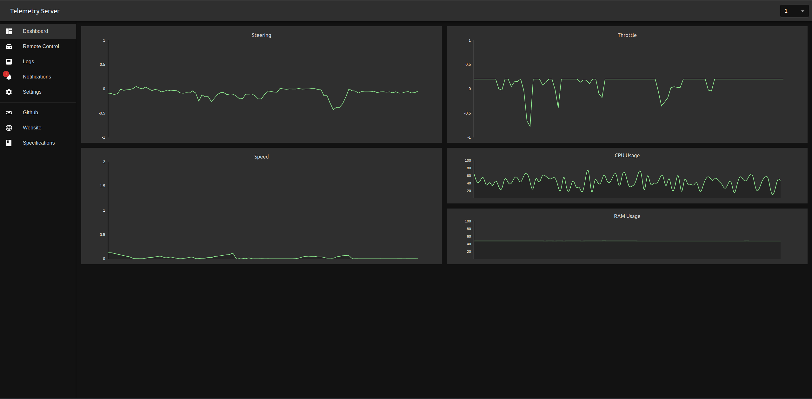
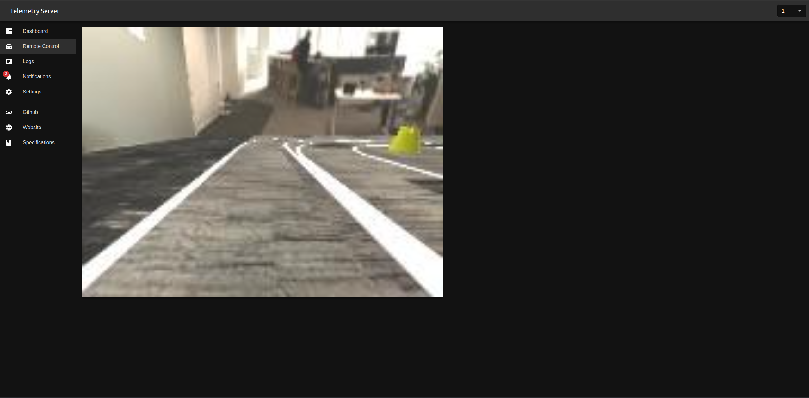
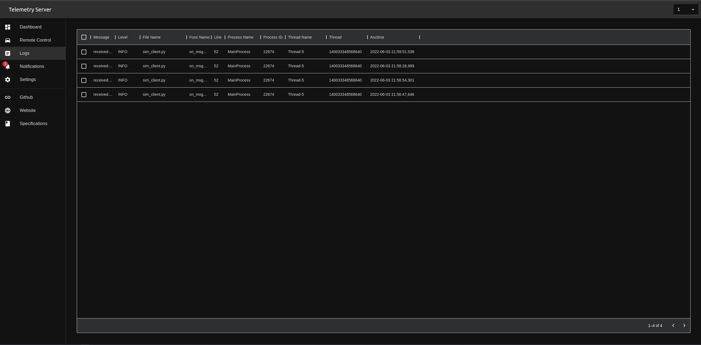
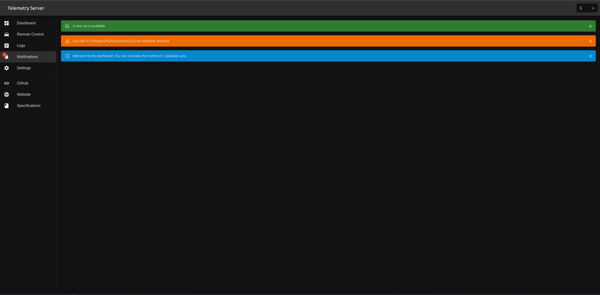
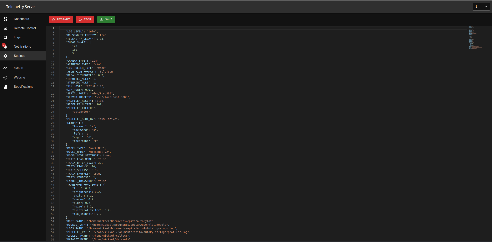

# Telemetry Server


This server helps to collect and analyze telemetry data from autopylot.








## Installation
```bash
npm i

or 

yarn
```

### Start Development
```bash
npm run dev
```
### Start Production build
```bash
npm run build
npm run start
```

then open http://localhost:3000/

## Usage

### Before starting
In your `settings.json` of your autopylot client, change the following line with the host and port you need.
```json
"SERVER_ADDRESS": "ws://localhost:3000"
```

> Don't remove the `ws://` or change the protocol to `http://` as it will not work.


### How to use
- start the server with `npm run start`
- open the client in a browser at http://localhost:3000/ or your custom address
- [start the autopylot client](https://github.com/Autonomobile/AutoPylot#deploy)

> if everything goes well, you should see a popup with a message telling you that a new car is connected.
- select the car with the dropdown menu in the top right corner
- start tracking !

